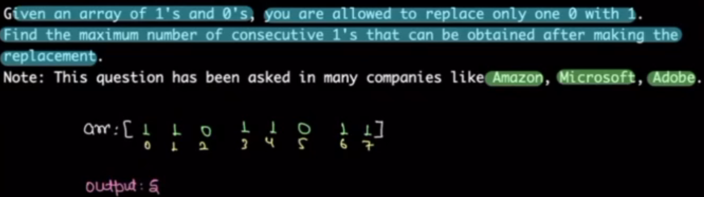
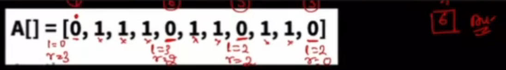
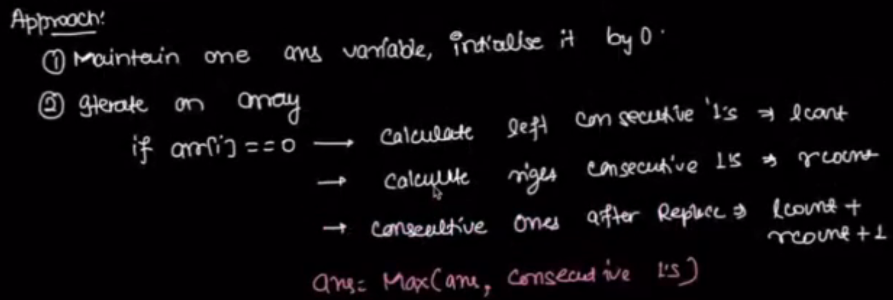
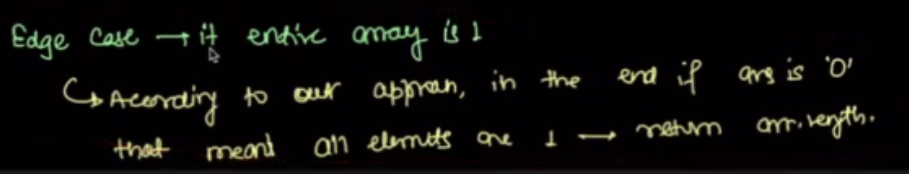
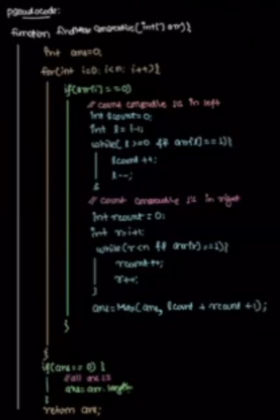
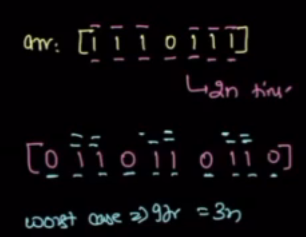
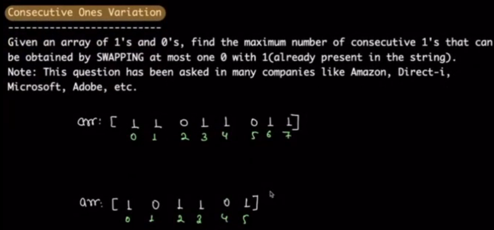
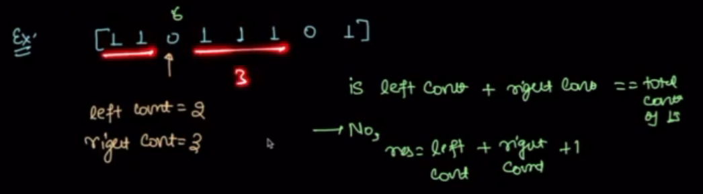
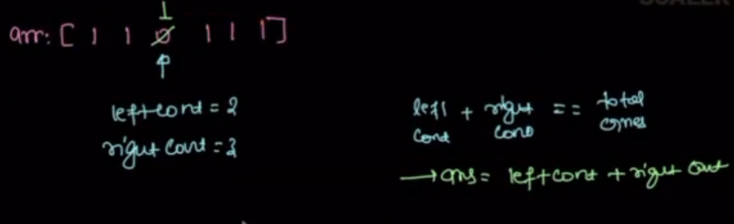
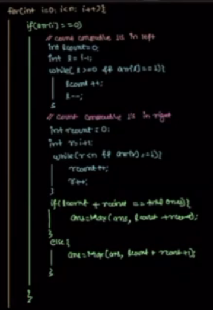

# Notes on 1D array problems

Edge Case:

psudo code:

TC: worst case, best case

## Consecutive once, varient 1 

My approch:
count total ones t
total 1s == lenth of array return t
for every 0 finding, count l and r
l + r + 1 <= t
    ans = max(ans, l+r+1)
else:
    ans = max(ans, t)
