# Arrays 1D
## Max subarray sum
1. brute fource approch
2. using prefix sum approch
3. carry forward approch
4. Kadane's algo

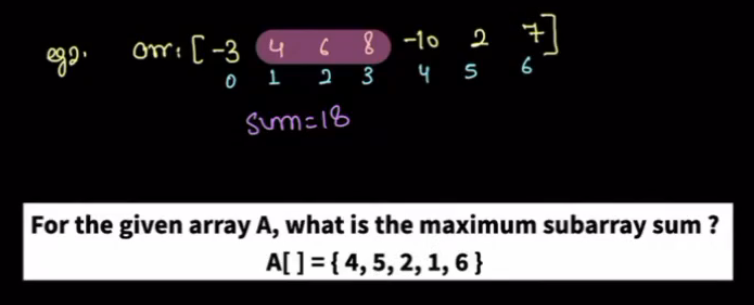
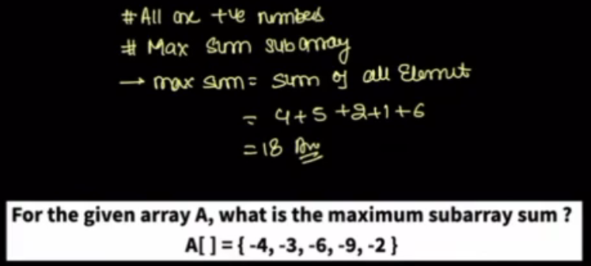
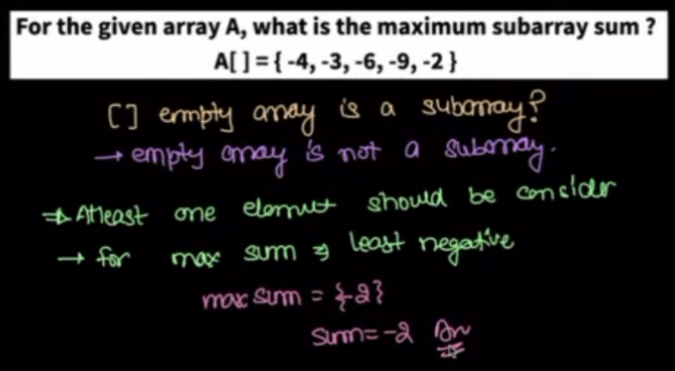
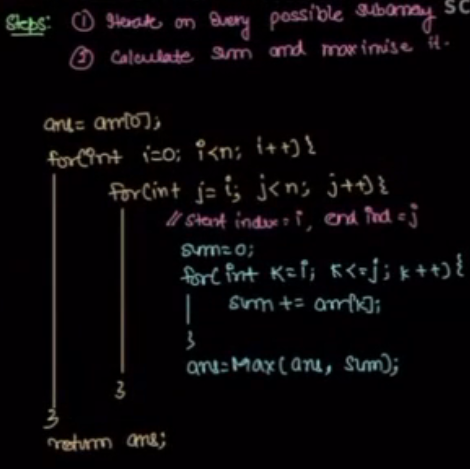

prefix sum Explanation:
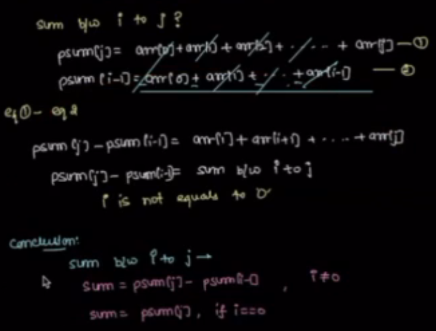
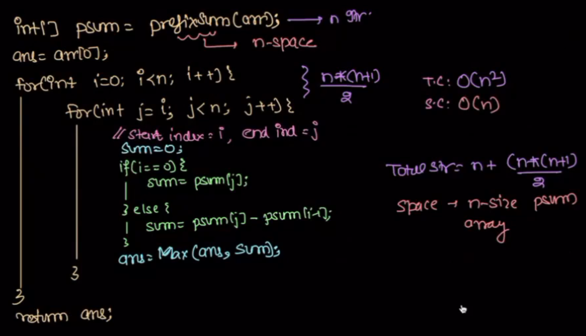

carry forward:
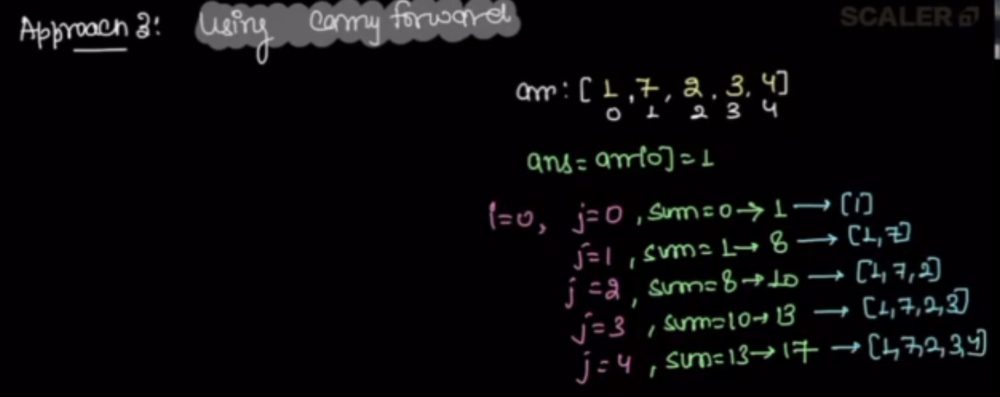
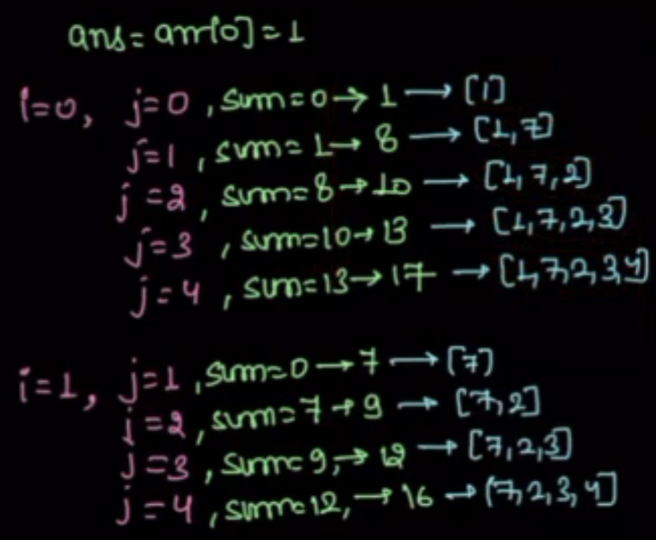

Kadan's algorithem:
 -> maxsum subarray

 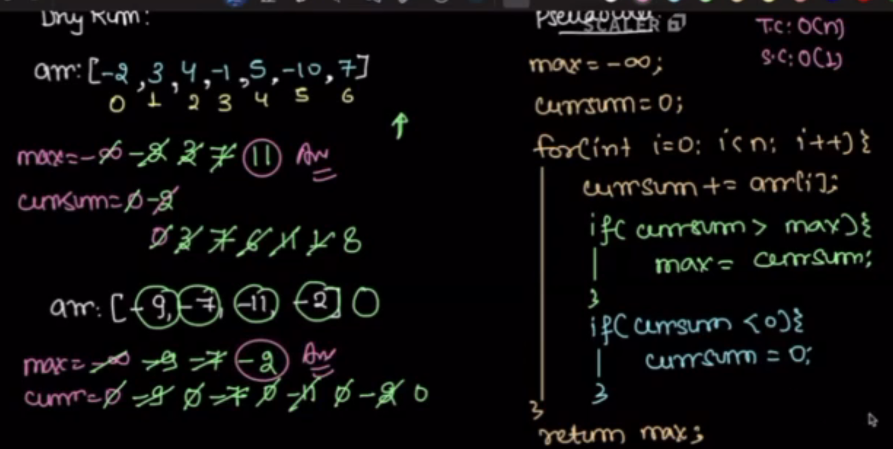
## queris from i to last index
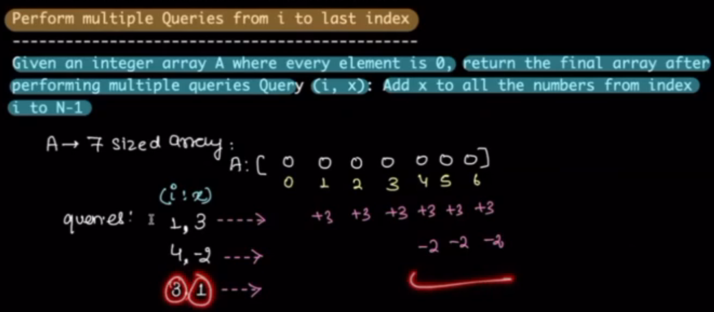
Brute fource:
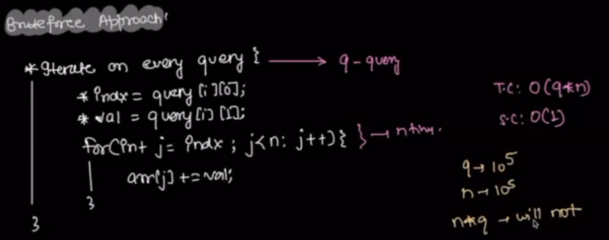
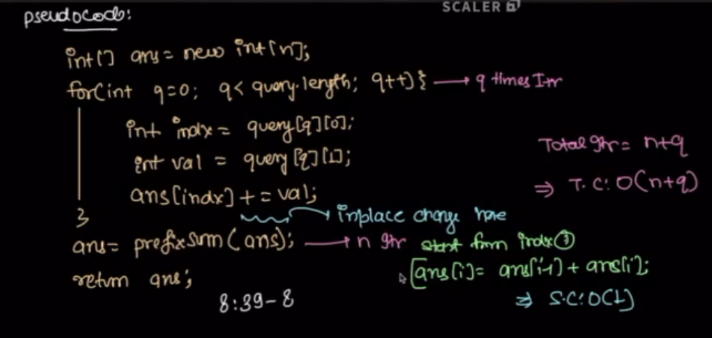
## queries from index i to j

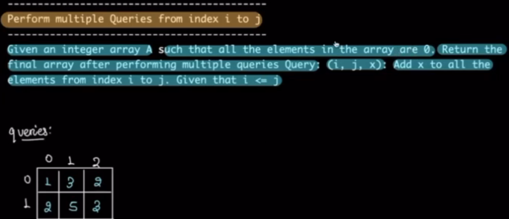

Brute fource: iterate the query for i to j iterate A and increment the each elements.

TC: O(Q*N) SC: O(1)
i.e
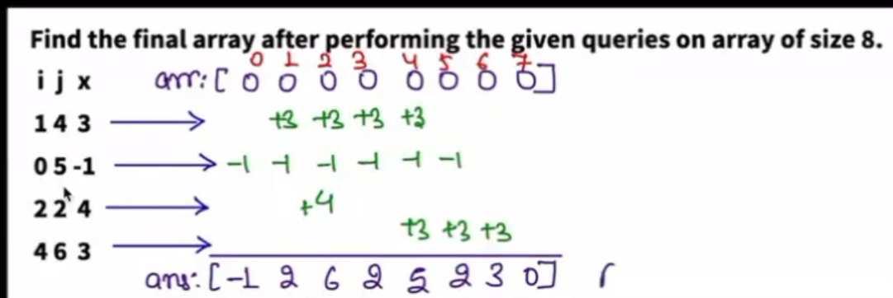

Optimized Approch:
for every query,
    update A[i] += value
    update A[j+1] -= value

Calculate the prefix sum and return

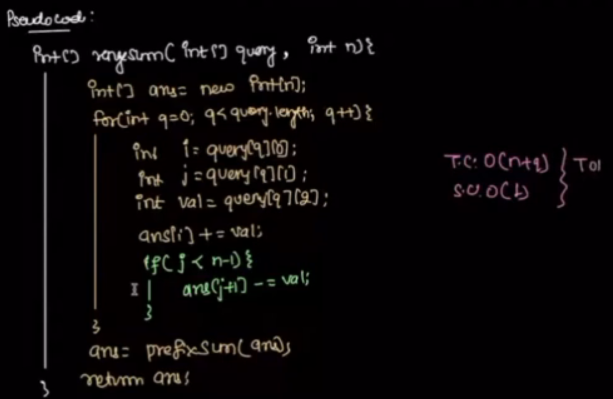

## merge intervals


IMPORTENT: Start time <= End time

2, 6 and 3, 7 
Point: both intervals over lapping hence we can merge them.
How to find if overlapping or not?
interval1: 2,5
interval2: 8,10
s1=2, s2=8, e1=5, e2=10

```python
#Possible Non-overlapping Intervals
#s1|-----|e1  
#    s2|-----|e2
#s2-----e2  
#    s1-----|e1
# if e1<s2 or e2<s1: or
if s2 > e1 or s1 > e2
    #No Over lapping
    pass
else:
    #Over lapping hence merge it
    mergedInterval = (min(2, 3), max(6, 7))
```

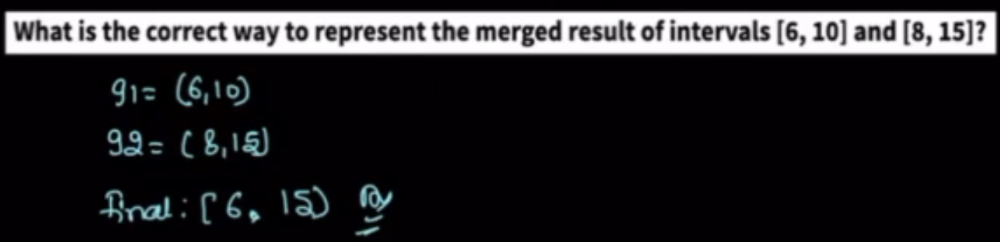

## merge sorted overlapping Intervals

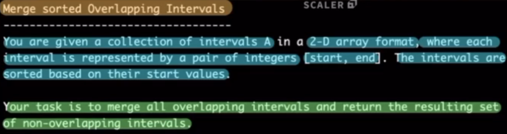
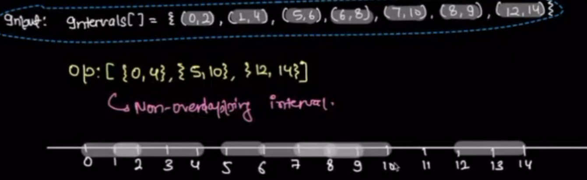

i.e
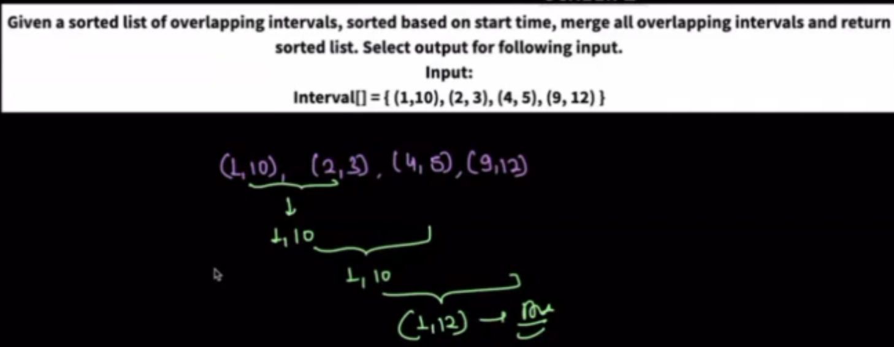

Code:
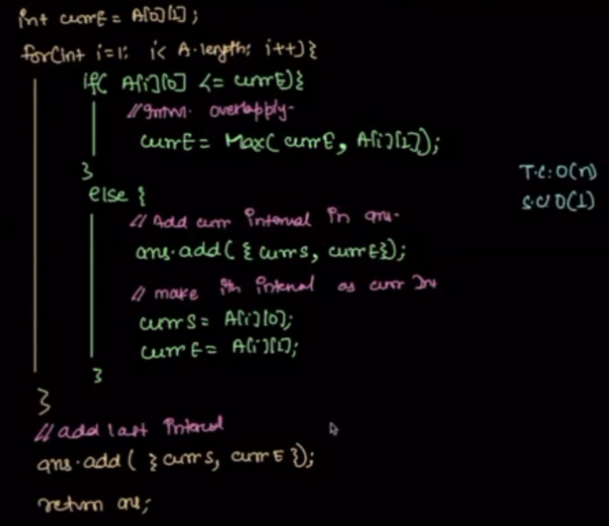

## senario based problems: TODO


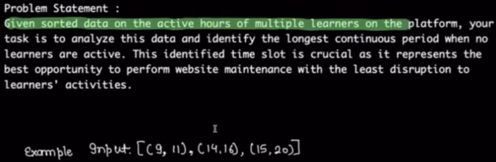

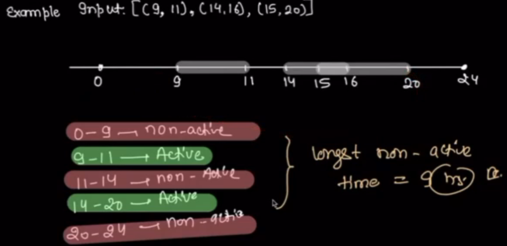