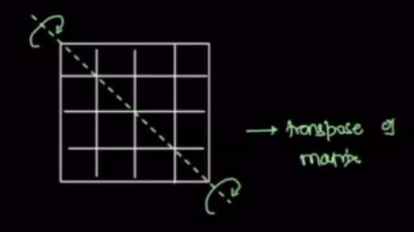
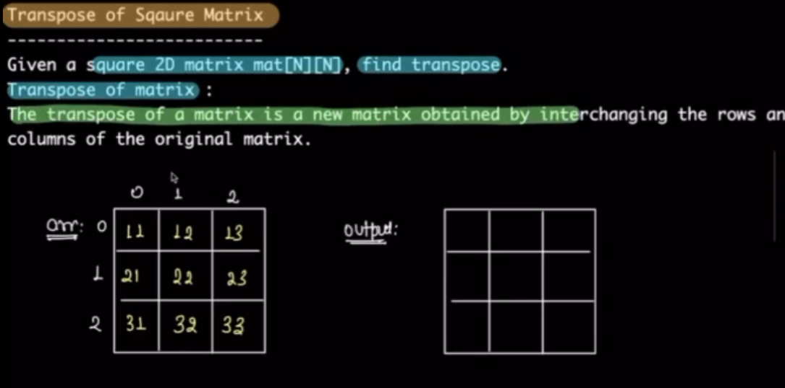

# DSA Notes

## Transpose of squire matrix

means the row of original matrix becomes columns in tranposed matrix and vice versa.

meaning while we are rotating the matrix what happens.

Squre Matrix:

Rectangular Matrix:

## rotate matrix 90 degree

## max number of consecutive 1 after replacement

## consecutive once variation

## Reverse string word by word