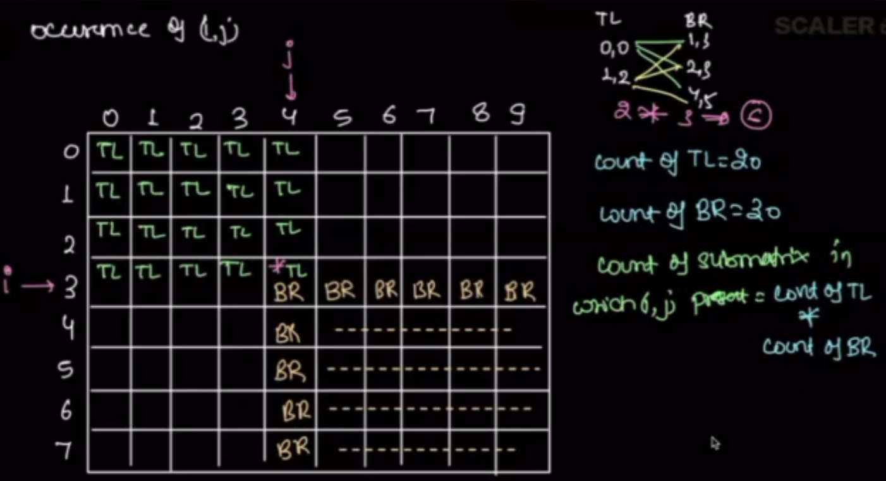

## Mock Interview & Manatary evalutation tests

1. DSA module 1
    - contest 1
2. DSA module 2 
    - contest 2
3. DSA module 3
    - contest 3
4. DSA module 4
    - contest 4
5. Mandatory evaluation test (from all four modules)
    - GET Certification of DSA
6. Mock Interview
    - 1 hour interview

# Notes

## Agenta today
1. Quizes
2. Search in Row wise, col wise Sorted Matrix
3. What is Submatrix and how can we uniqely identify it.
4. sum of all submatrics sum - contribution techniqe
5. Find first missing integer.

### Quizes


Moor's algorithem -> Find majority element in array
Dijkstra's algo -> used in Graph
Kadaane's algo -> max sum of subarray in array


### Search in Row wise, col wise Sorted Matrix


Brute fource:
for every row and every col check if k available. O(N*M)


```python
for i in range(N):
    for j in range(M):
        if A[i][j] == k:
            return True
return False
# TC: O(N*M) constant space
```
Optimized Approch:
since matrix is sorted row wise and column wise.


```python
# from the Top Right of matrix
    # ele is lesser ele in its col
    # ele is gratest ele in its row
i = 0
j = m-1

while(i<N and j>= 0):
    if A[i][j] is k?
        return True
    elif is it > k?
        move towards left
        j-=1
    else: # ele <k 
        move towards down
        i+=1
return False

# from the bottum left of the matrix
    # ele is Grater element in its col and 
    # lesser in its row
i = N-1
j = 0
while (i>=0 and j <N):
    if A[i][j] == k:
        return True
    elif ele > k:
        # move right
    else: # ele < k
        # move top
return False
```


quiz:


TC: (N+M)

For Binary Search:
    **It can search ele in sorted array in logn time**

What is LogN:
```
when we have n + n/2 + n/4 + n/5... = logn
```

Binary search is not better than N+M approch


### What is Submatrix and how can we uniqely identify it.


Problem:


for i 
    for j
        start = (i,j)
        end = (N-1, M-1)
        


Solution:

how many times i, j appears in all possible




Generic Dimentions:

**Frequency of (i,j) element =  TL counts * BR counts**
row*col * row*col
(0,i) * (0,j) * (i,N-1) * (j,M-1)
i-0+1 * j-0+1 * N-1 -i +1 * M-1 -j +1
i+1 * j+1 * N-i * M-j

**Contribution of (i,j) element = Freq of (i,j) * ele**

Code:

### Find first missing integer.


Brute Force


Optimized with Sorting:

Observations:
    smalest posible ans = 1
    max possible ans = N+1
    N+2 never a anser.

1. Replace zero and -ve values into N+2
2. Sort the array.
3. Iterate array and find missin Natural number

Code: 
TC: O(N + NlogN + N)
SC: O(logN)

```python
# step 1
for i in range(N):
    if A[i] < 1:
        A[i] = N+2
# step 2
A.sort()
# step 3
for i in range(N):
    if A[i] != i+1:
        return i+1
return N+1 # if no ans returned already.
```

Optimization: 
Assuming the A has +ve elements only.
1. range = 0, N-1
2. for every ele in A, mark the (ele-1) Index to negative
    consider abs value of ele
    while marking if already ele is marked -ve ignore it.
3. Iterate again, check if any ele not marked. 
    if yes return it
    if no return N+1

code: N+N+N = 3N => O(N)
SC: O(1)
```python
#If A has -ve ele
# mark them N+2

N = len(A)
# marking the ele with -ve
for i in range(N):
    ele = abs(A[i])
    if ele in range(1, N+1):
        index = ele-1
        A[index] = abs(A[index]) * -1

for i in range(N):
    if A[i] > 0:
        return i+1
return N+1
```

