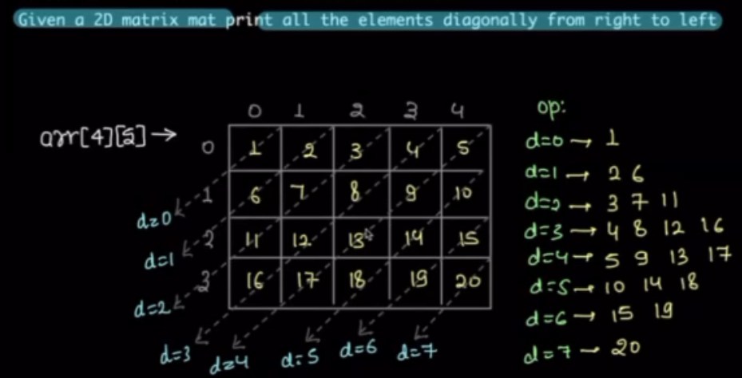

# Notes on 2D Matrices

This section covers the basics of 2D matrices, including their structure, operations, and common use cases in programming and mathematics.

## Introduction
[][] array of arrays

2D array vs Matrix?

If number of columns in each and every row are same is called Matrix.

We will use it in the Dynamic programming

## Problems

Given Matrices Print row-wise sum

TC: 

Given Matrices print col-wise sum

given a square matrices print diagonals

principle, angi diagonal

TC: O(N)

given a square matrices print anti-diagonals

TC: O(N)

print diagonals in rec
    matrix (right to left)

    total diagonals = row + col -1

Optimization:

Row to column zero

