# Bit Manipulations

## Number System and conversion

### What is number system:

#### Desimal Number System:
1. We use every day
2. known as base-10 system (323) base 10
3. Because this number system has 10 digits in total 0-9

```
342 => 300 + 40+ 2 => 3*10^3 + 4*10^1 + 2*10^0

```

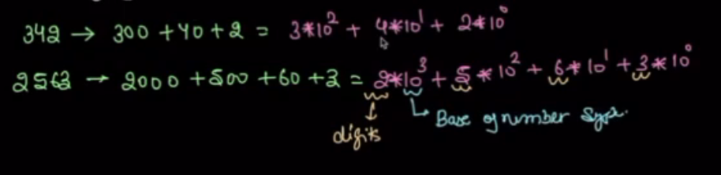
#### Binary Number System
1. Also known as Base 2 systems (1100) base 2
2. Because this number system have 2 digits in total 0-1
3. It is used in computer ans ditial electronics

```
10100 => 1*2^4 + 0*2^3 + 1*2^2 + 0*2^1 + 0*2^0
    => 1(2*2*2*2) + 0(2*2*2) + 1(2*2) + 0*2 + 0*1
    => 16 + 0 + 4 + 0 + 0
```
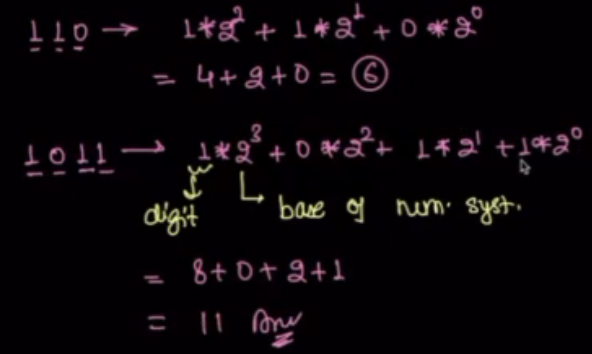

#### how to convert binary to desimal
1. Multiply each digit with base 2 to the power of Index value
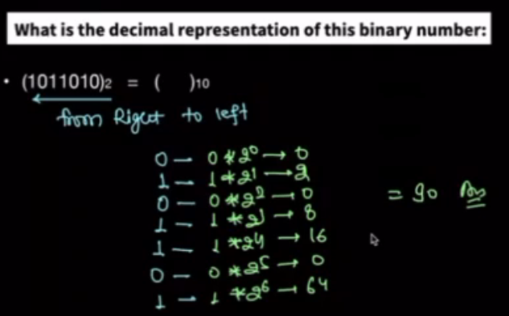

#### how to convert desimal into binary:
1. Using long divition method
2. divdide by 2 untill 1 or 0 in reminder

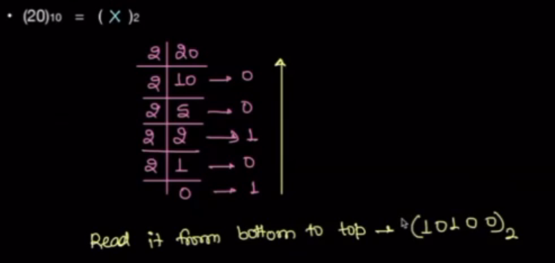


how to convert binary into desimal:

## Addition of two numbers:

Digits:
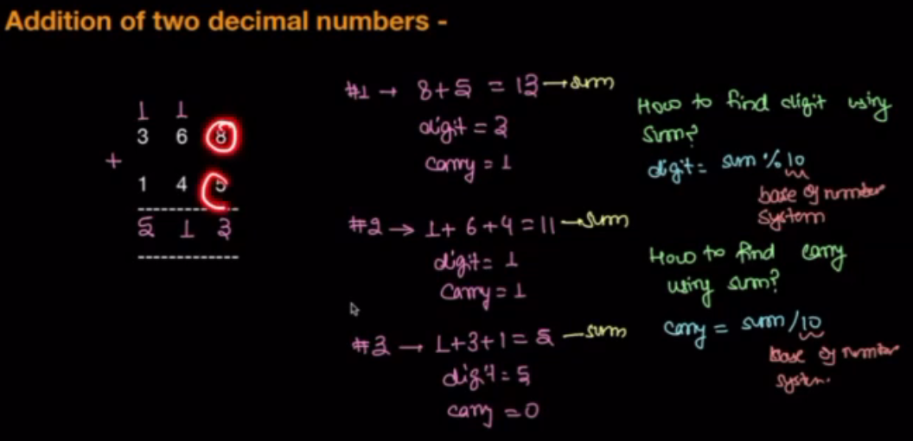

Binary:
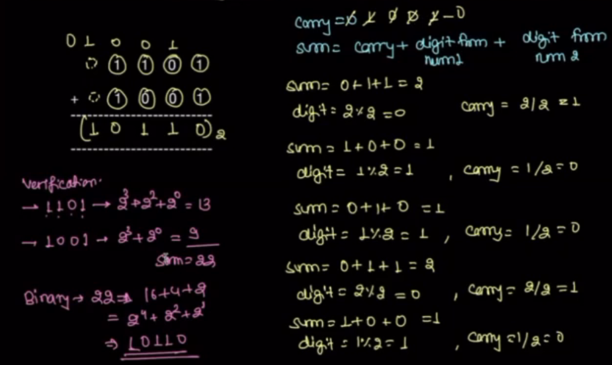
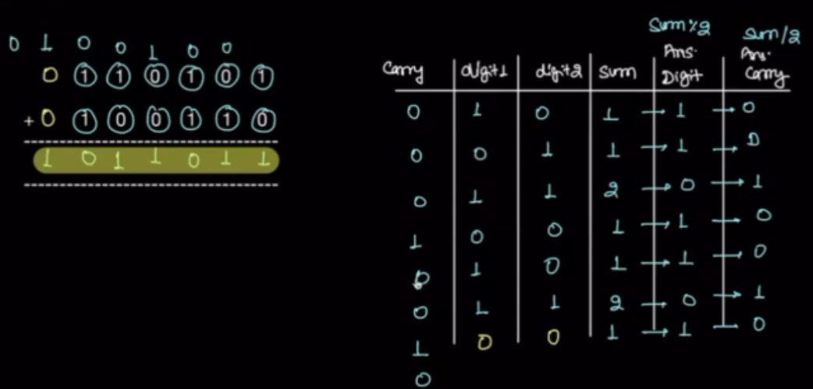
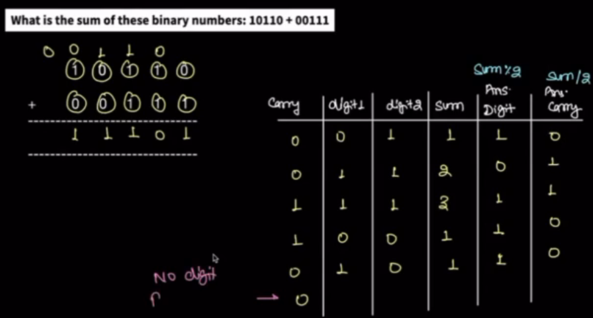

Code:
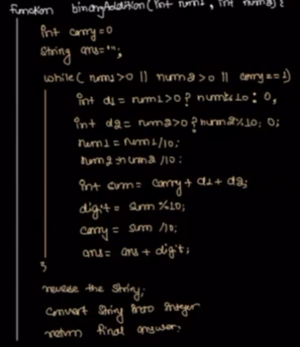

## Bitwise Operator

Note: Exicution time using bitwise operator is faster than any other operator (logical & arithmetic operators)

```
! Not
& And
| Or
^ XOR
<< Left Shift
>> Right Shift

0 False/Unset/Off
1 True/Set/On
```
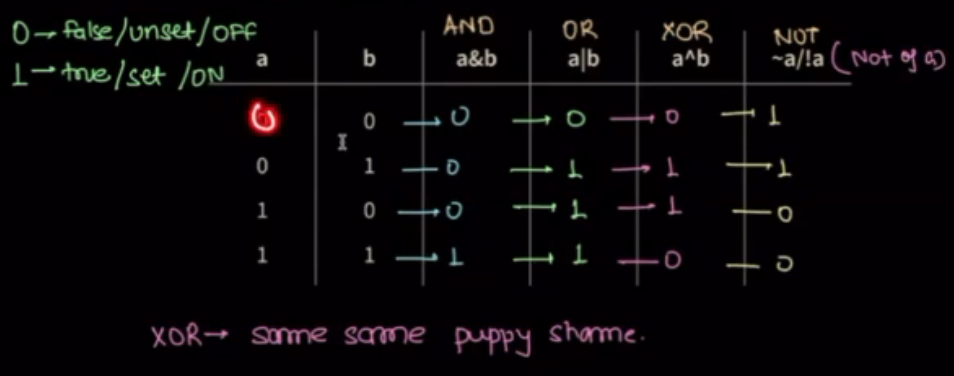

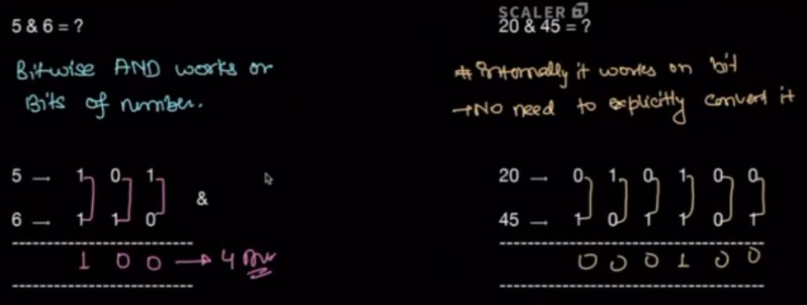

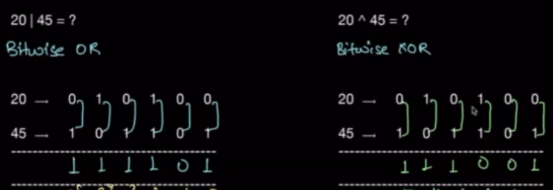

Note: Bitwise operator always write it inside brackets

Orders or Precedence in Bitwise Operator??

## Negative numbers

preserve one bit for sign and other bits for numbers

most significient Bit is 0 = positive number
least significient Bit is 1 = Negative number

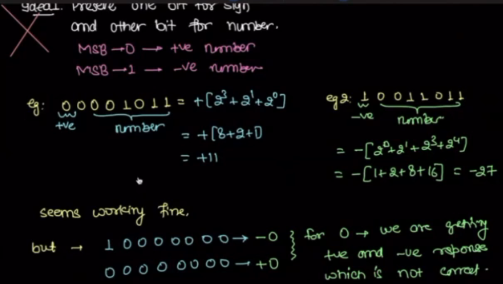

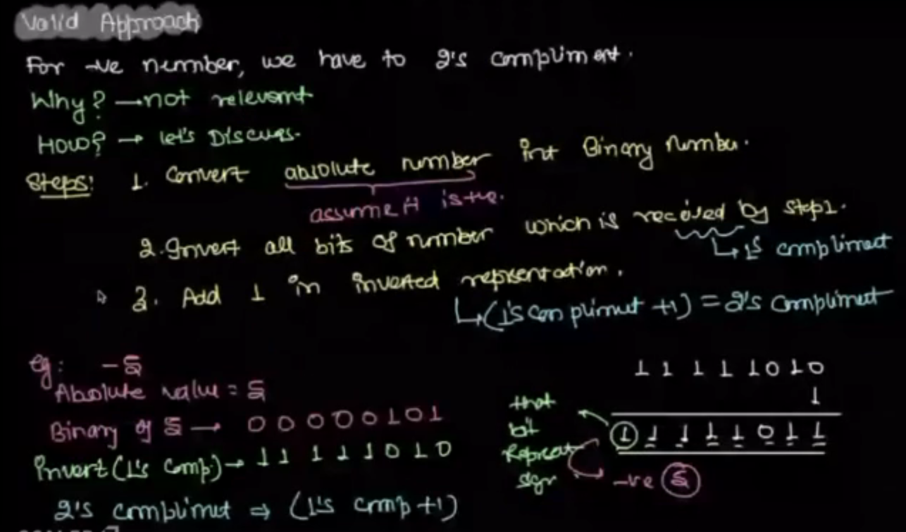

## Range of numbers

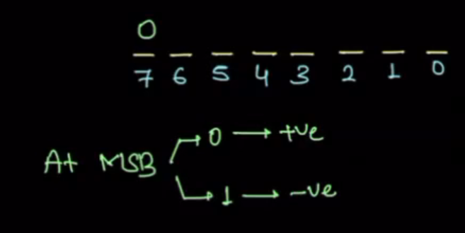

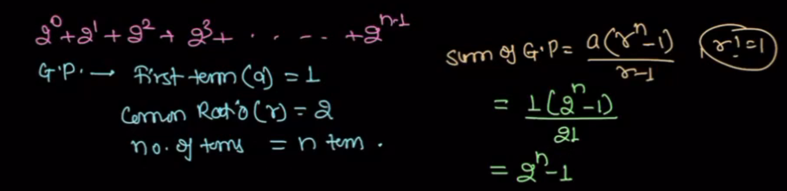

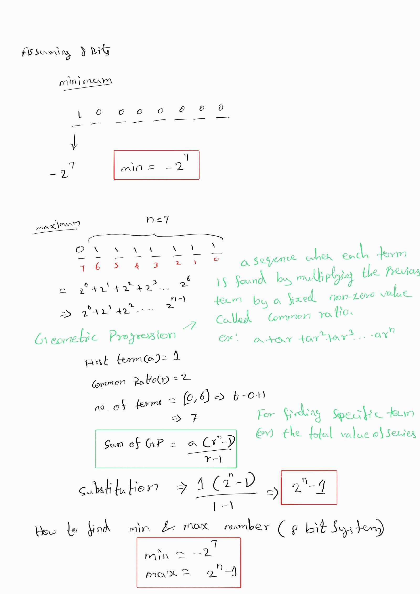

range of desimal is 2 to the power of 31

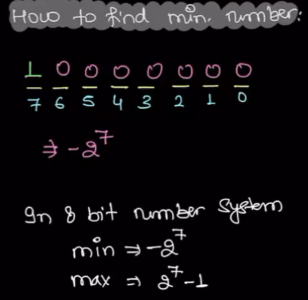
How to make max number:

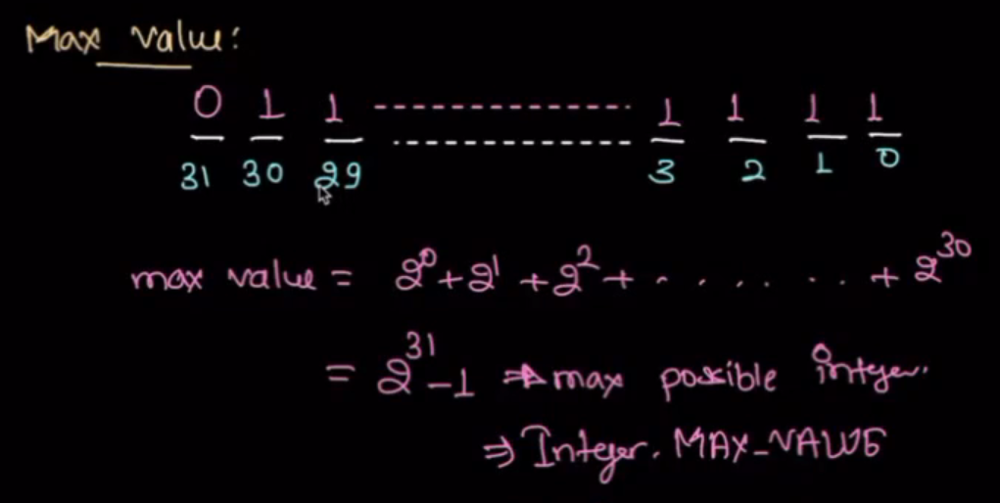
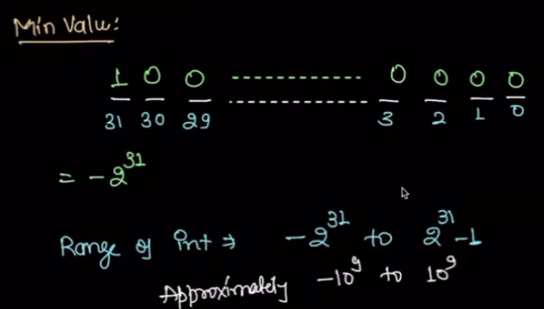

TODO: long (64 bits)
    min = -2 ^ 63
    max = 2 ^ 63 -1  

Note: If the first bit is set it is ODD number