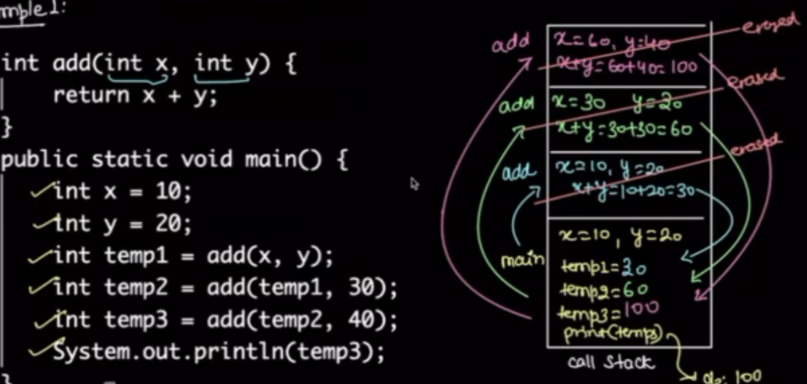
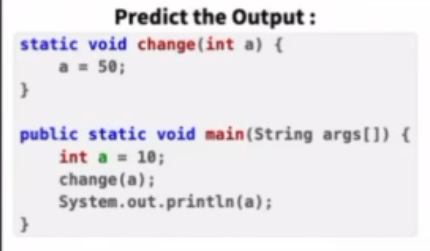

# Memory Management

## Call Stack

stacking items one top of another.

Insert on top always
Remove from the top always

Last in first out ("LIFO" principle)

how function will behave in call stack

example 1:


Example 2:


Example 3:


it will be helpfull in recursion

## What is Reference Variable?

a = 10

a (Reference Variable) 
    => row1 col3 (Address)
        => 10 (Valure is stored)

## Types of memory in Java

### Premitive Data Types
    byte , sort, int(0), long, float(0.0), double, char(null), boolean(false), 

### Stack memory:
    All the premitive data types & 
    Refernce variables (a = row1 col2).
    are stored here.

### Heap memory
    Content of the 'Reference Variables' called 'Objects' are stored here.

Example1: 

Example2: 

Example3: 
    Type of Mark and Swipe algo works in Garbage collector
    It Try to mark it if not able to mark, swipe it from memory
    Note: there is no Garbage collecter in C++, we have to remove it form memory (otherwise memory fills it is called 'Memory Leaks')
    
```java
In Java it is always pass by value
premitive data type: copy of value (Can't Modify Original)
Objects: copy of reference location (Can Modify Original)
Pass by Value: sharing same variable accorss different level of stack
```

```python
Imutable: int, str, tuple
Mutable: list, dict 
```

Example3: 
Example4: 
Example5: 

```java
System.out.println(mat.toString());
// Equivalent to: ClassName@HashCode
```
```python
print(mat.__str__())  
# Equivalent to: [ [5, 0, 0], [25, 0, 0] ]

#__str__() called special methods in python
```

Example6: 
Example7: 

quiz1: 
quiz2: 
quiz3: 
quiz4: 
quiz5: 
quiz6: 
quiz7: 

## how arrays are stored
how arrays are stored in heap & stack memory

