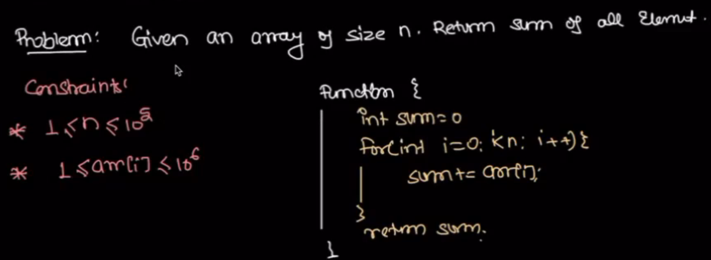
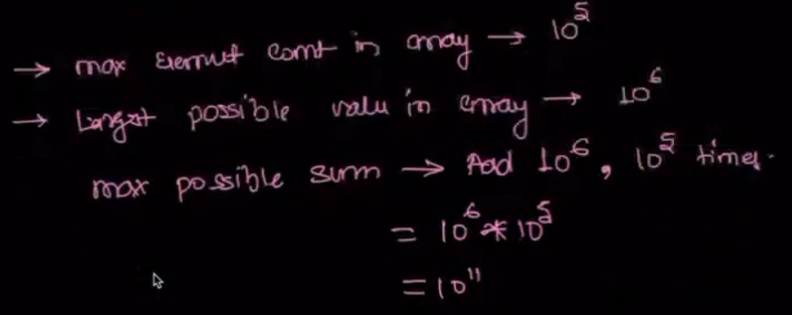

## Importence of Constrains.

## Interms of Time Complexity:

1 sec is 10 ^ 9 iterations (in fact 10^8 iterations)

## Interms of Data types:

Example:

Problem Identified:

We should use long otherwise overflow