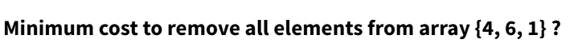
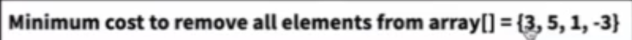
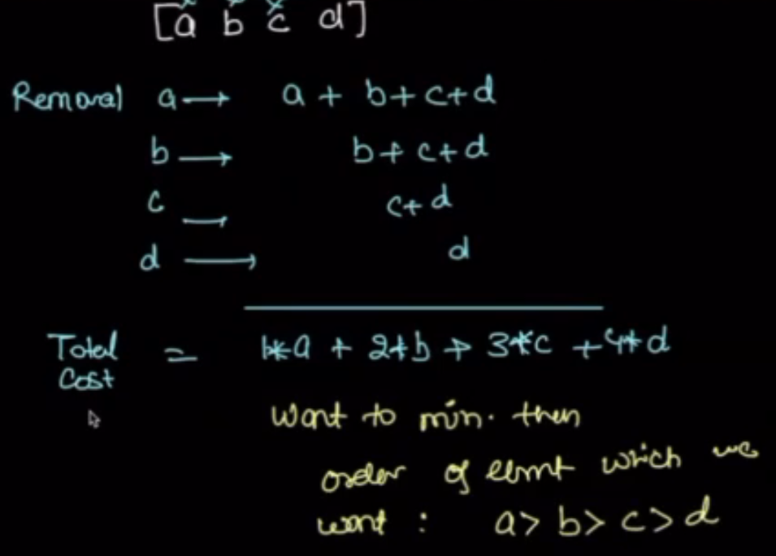
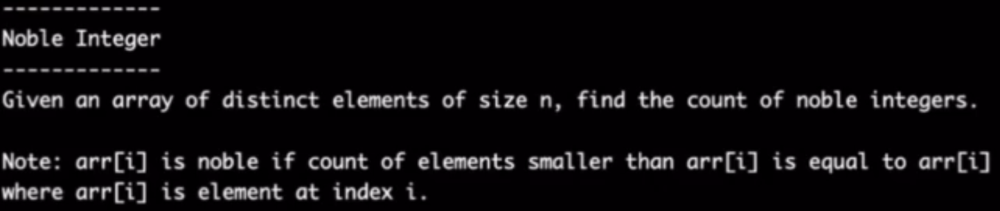
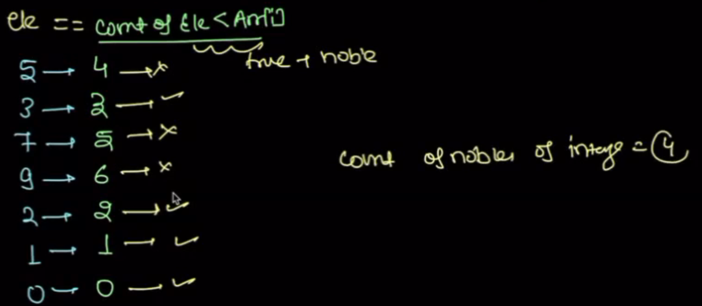
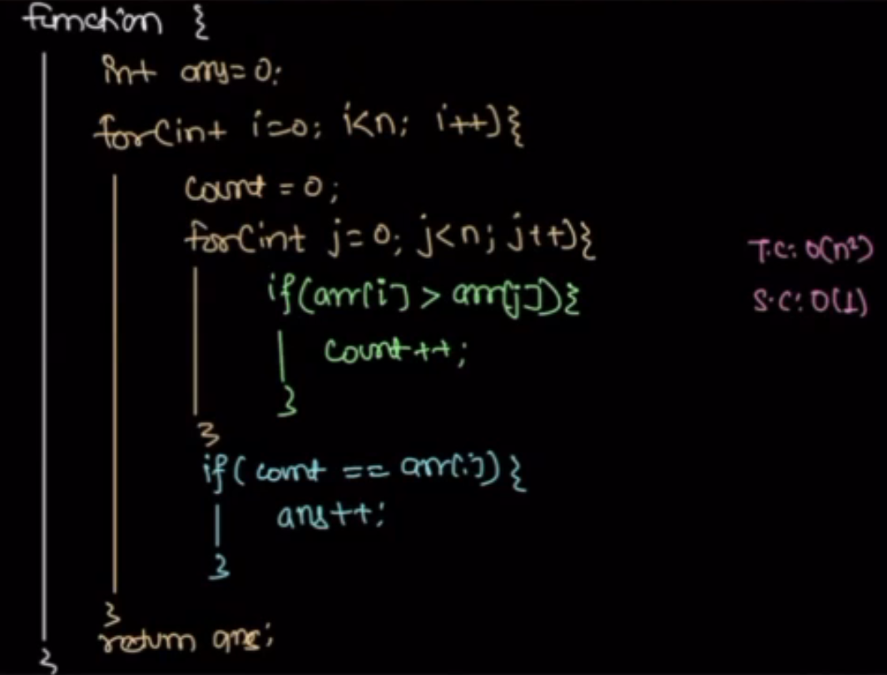
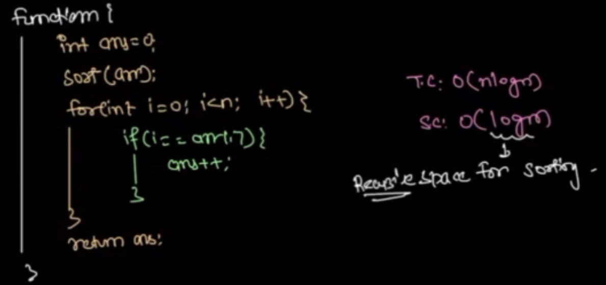
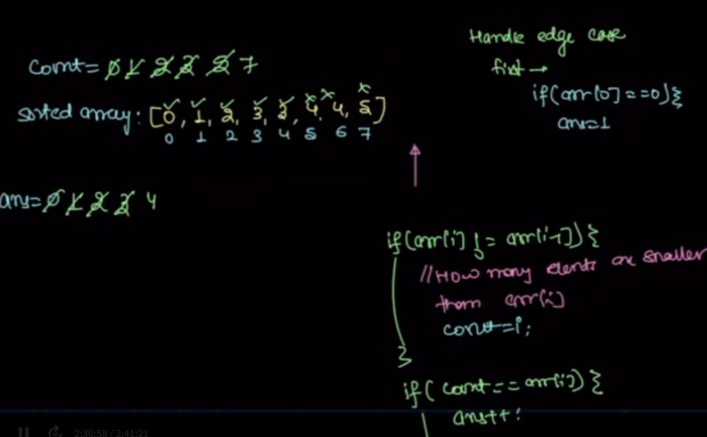
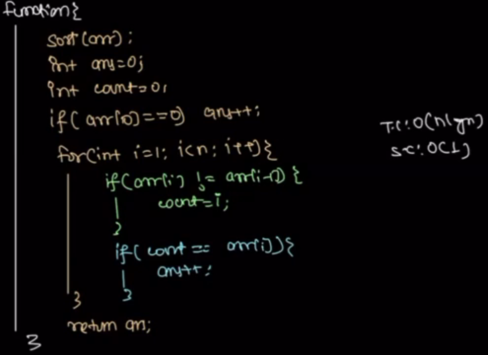

## Sorting basics

what is sorting?
    Arranging the data in specific order. Or
    Arranging the data based on some condition.

Example1:     factors count

Why sorting?
    Organizing, analyzing improvement, Searching improvement.

In-build sorting method:
1. Python: arr.sort()
2. Java: Arrays.sort(arr)
3. C++: sort(arr.begin(),arr.end());

## Problems
1. Minimize the cost to empty array:
    Given int[].
    objective is to minimize the total cost of emptying the array.
    The cost: the sum of all the ele in array at the time of removal.
    [2, 1, 4]

quiz1: 
quiz2: 

Observation: From height element to lowset element

TC: O(NlogN)

2. Noble Integer 
Find the noble element from distince array n
Noble: 
When index curser is at A[i]. A[i] is noble, if the count of elements smaller than A[i] or is equal to A[i] 

Psudo code:

Optimal approch:

