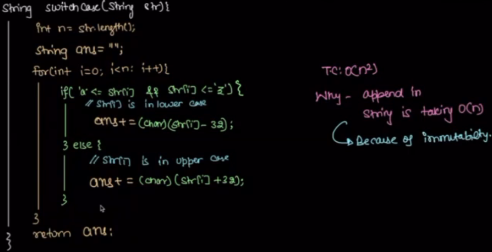

# Notes on Strings

Sequence of characters within doble qoutes or single qoutes
Array of characters in c++, not in java or python since it is imutable

## Character:

Character is single unit of text such as letter, digit, symbol, whitespace.
char in java

everything stored in computer as binary. Hence, character also stored as binary.

    Every character has its own ASCII encoding standard value between 0 - 127. which is decimal number.
    ASCII uses 7 bits to represent char

1. 0-31 and 127 -> control characters (newline, tab etc..)
2. 32 - 126 -> printable characters (space, digit, letters, symbols)

#### Common ASCII Characters:

Decimal	Character	Description
32	(space)	Space
33	!	Exclamation mark

48–57	0–9	Digits
65–90	A–Z	Uppercase letters
97–122	a–z	Lowercase letters

```python
# Get ASCII value of a character
print(ord('A'))  # Output: 65

# Get character from ASCII value
print(chr(65))  # Output: 'A'
```


## Questions on Strings





## Imutability

whos state can not be changed after they are created.

Immutable Types:
Numbers:
    int (e.g., 1, 42)
    float (e.g., 3.14, 2.0)
    complex (e.g., 1+2j)
    bool (e.g., True, False)
Strings:
    Example: "hello", 'world'
Tuples:

    Example: (1, 2, 3)
Frozen Sets:

    Example: frozenset({1, 2, 3})
Bytes:

    Example: b"immutable"

## Overflow:


Possible lossy convertion

Explict typescasting is required if long to int


```python
# Using a list to build a string
parts = []
for i in range(5):
    parts.append(f"Part {i}")

# Join the list into a single string
result = "".join(parts)
print(result)  # Output: Part 0Part 1Part 2Part 3Part 4
```

### converting string into character array

```python
# Example 1: Using list()
string = "hello"
char_array = list(string)
print(char_array)  # Output: ['h', 'e', 'l', 'l', 'o']
# Example 2: Using List Comprehension
string = "hello"
char_array = [char for char in string]
print(char_array)  # Output: ['h', 'e', 'l', 'l', 'o']
```

# Sub string


### Palindrome string
    Sequence of characters should be same from forward and backword direction.


Optmization:


TC: 
N * (N/2 + N/2)
O(N^2)


Dedicated space availabe for string data = string common pool

Python has a string interning mechanism, which is similar to the concept of a string pool in other languages like Java. This mechanism is used to optimize memory usage and improve performance for immutable strings.

What is String Interning in Python?
String interning is a process where Python stores certain strings in a string pool (a part of the heap memory) to avoid creating multiple copies of the same string.
If two strings have the same value and are interned, they will share the same memory reference.
When Does Python Intern Strings?
Python automatically interns:

Strings that look like identifiers (e.g., "hello", "world", "abc123").
Short strings (implementation-dependent, typically strings with a length of 0–20 characters).
Strings explicitly interned using the sys.intern() function.

```python
a = "hello"
b = "hello"

print(a is b)  # Output: True (both refer to the same memory location)

c = "hello world"
d = "hello world"

print(c is d)  # Output: False (longer strings may not be interned automatically)
```


