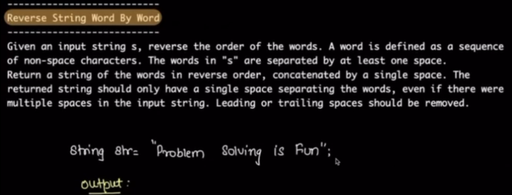
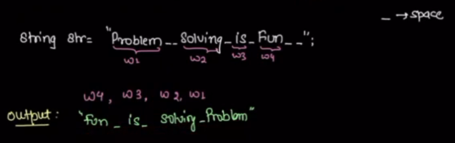
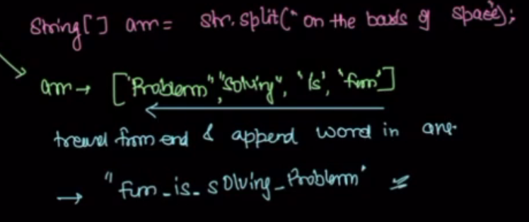
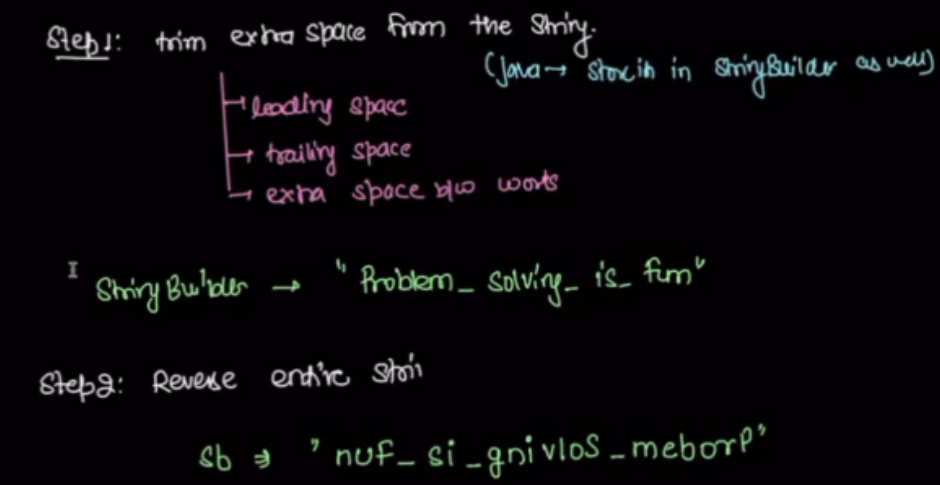
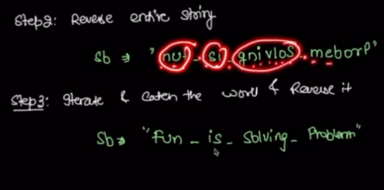

# problem 1

Examples:

simple approch using internal function .split()

My approch:

ans array created
using flag ch or sp

iterate A from last. look for chr
update flag = ch and append chr to temp array.
once space is found flag = sp and update ans from temp + space.
look for chr and flag = ch and append chr into temp....

better:

