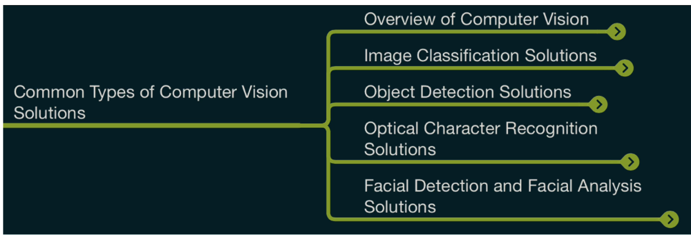

## Machine Learning

### Regression:
To predict a numeric label based on featreu values

### clacification:

#### Binary clasification:

to predict whether the label is 1 or 0 based on feature

#### Multi class clasification:
To predict which of multiple possible classes an observation belongs to based on the features

### Clustering:
To identify similarities btw observations based on features & group them into clusters

## Deep Learning
uses Artificial Neural networks based on un-structured and un-labeled data

## Computer Vision Service

It is field in computer science that focuses on enabling computer to identify and understand object & people from image and videos

## Azure AI Vision

## NLP

